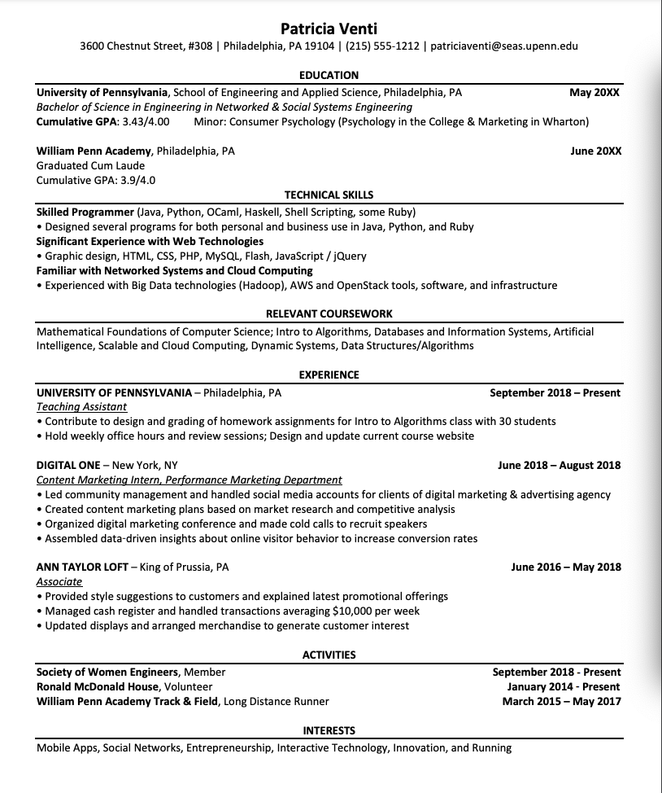
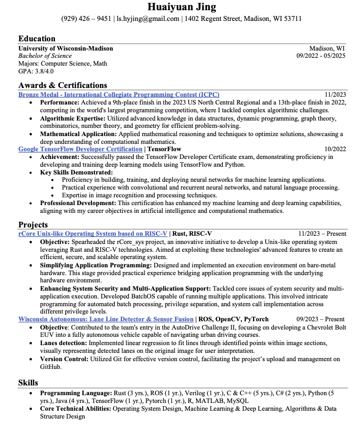

# LLM-based Resume Extraction and Similarity Pairing Micro-service 

This microservice is designed to process resumes by extracting information from raw PDF files, generating inferences, and storing these in a vector store. The vector store can then be used to retrieve similar users based on the provided inferences.

## Table of Contents
- [LLM-based Resume Extraction and Similarity Pairing Micro-service](#llm-based-resume-extraction-and-similarity-pairing-micro-service)
  - [Table of Contents](#table-of-contents)
  - [Installations and Requirements](#installations-and-requirements)
    - [Requirements](#requirements)
    - [Installation Steps](#installation-steps)
  - [How Tags and Inference Are Conducted from Raw PDF](#how-tags-and-inference-are-conducted-from-raw-pdf)
      - [Two kind of information extracted](#two-kind-of-information-extracted)
    - [Extract Text from PDF](#extract-text-from-pdf)
- [Extract Information](#extract-information)
- [Generate Inference](#generate-inference)
- [Store in VectorStore](#store-in-vectorstore)
- [Similar background Retrieval](#similar-background-retrieval)
- [VectorStore: Benefits for Retrieving Similar Users](#vectorstore-benefits-for-retrieving-similar-users)
    - [Benefits](#benefits)
    - [Key Methods](#key-methods)
  - [Example output of extraction -\> extracted\_info and Inference](#example-output-of-extraction---extracted_info-and-inference)
  - [Example output of Retrieval](#example-output-of-retrieval)
- [Next Update](#next-update)
      - [- Update Langchain Version](#--update-langchain-version)
      - [- Better template](#--better-template)
      - [- Store data](#--store-data)
- [Possible warning and bugs](#possible-warning-and-bugs)


## Installations and Requirements

### Requirements
- Python 3.11+
- pip (Python package installer)
- OpenAI API Key
- Tesseract OCR
- Langchain packages
- Chroma
- (or requirements.txt)

### Installation Steps


1. **Set up a virtual environment**

    ```bash
    python3 -m venv venv
    source venv/bin/activate
    ```

2. **Install the required packages**
    There might have some redundant packages in requirements.txt.

    ```bash
    pip install -r requirements.txt
    ```

3. **Install Tesseract OCR**

    Follow the instructions for your operating system from the official [Tesseract OCR GitHub page](https://github.com/tesseract-ocr/tesseract).

4. **Set up environment variables**

    Create a `.env` file and add your OpenAI API key:

    ```env
    OPENAI_API_KEY=your_openai_api_key
    ```
5. **Head to**
   http://127.0.0.1:5000/apidocs
   two features:
    1. retrieve similar resume based on your description
       1. you can write your own query like: "Working at tech" - it will retrieve the most similar resume inference from db based on that query.
       2. you can copy paste an inference from your own resume and see who are the most matchable candidate.
    2. Upload resume and conduct inference of candidate
       1. Select resume you want to upload, it will scan - extract - infer your resume, and generate inference as well as tags.

## How Tags and Inference Are Conducted from Raw PDF
#### Two kind of information extracted
**1. Inference**: Initial filter for matching users - distilled information
**2. extracted_info**: Display as tags on Swipe-to-Connect page
### Extract Text from PDF

The function `extract_text_from_pdf(pdf_path)` uses Tesseract OCR to extract text from each page of the PDF.

```python
def extract_text_from_pdf(pdf_path):
    images = convert_from_path(pdf_path)
    resume_content = ""
    for image in images:
        resume_content += pytesseract.image_to_string(image)
    return resume_content
```

# Extract Information

Several functions use language models to extract different pieces of information from the resume text, such as personal information, education, work experience, and projects and skills.

```python
def extract_personal_info(resume_text):
    # Uses a language model to extract personal info
```

# Generate Inference
The function generate_resume_summary(extracted_info) uses the extracted information to generate a summary and inference about the candidate.

```python
def generate_inference(extracted_info):
    # Uses a language model to generate inference about the user's background
```

# Store in VectorStore
The extract_and_infer(pdf_path) function processes the PDF, generates embeddings, and stores them in ChromaDB using the VectorStore class.
```python
def extract_and_infer(pdf_path):
    # Process the PDF and store embeddings

```

# Similar background Retrieval
This function will select the most similar background users based on the given query.
For instance: "He is a skillful Spanish speaker"
This function in principle will return 5 most similar docs in the embedding space:
> 1. He is a proficient Spanish speaker  - L2 distance: 0.5
> 2. She is a proficient English and French speaker - L2 distance: 0.92
> 3. He is an efficient communicator - L2 distance: 1.3
> 4. They are good Spanish speakers - L2 distance: 2
>  5. Gonzalo is a spanish teacher - L2 distance: 3.1
  
```python
def retrieve_top_documents(query, top_k=5):
```
---

# VectorStore: Benefits for Retrieving Similar Users

> The VectorStore class leverages embeddings generated from user resumes to store and retrieve similar user profiles based on inferences.
**https://medium.com/@eugene-s/the-rise-of-embedding-technology-and-vector-databases-in-ai-4a8db58eb332**

### Benefits

- **Efficient Similarity Search**: By storing inference embeddings in ChromaDB, we can efficiently retrieve similar users based on the embeddings.
- **Scalability**: ChromaDB is designed to handle large-scale data, making it suitable for applications with growing datasets.
- **Flexibility**: The system supports multiple languages and can handle various text formats, including Chinese and English.

### Key Methods

- **`upsert_inference(vector_id, text, override_mode=True)`**: Upserts an inference into the ChromaDB.
- **`retrieve_embedding(vector_id)`**: Retrieves the embedding for a given vector ID from ChromaDB.

## Example output of extraction -> extracted_info and Inference

From resume: 


> {
  "Inference": {
    "inference": "Based on the information provided, Patricia Venti appears to be a highly motivated individual with a strong academic background and a diverse skill set. Graduating Cum Laude from both the University of Pennsylvania and William Penn Academy showcases her dedication to academic excellence. Her work experience as a Teaching Assistant at the University of Pennsylvania and as a Content Marketing Intern at Digital One demonstrates her versatility in both technical and marketing roles. Her proficiency in a wide range of programming languages and technologies, coupled with her experience in community management, content marketing, and data analysis, make her a valuable asset in the fields of software engineering, digital marketing, and data analytics. With a solid foundation in computer science and a proven track record of academic and professional success, Patricia has the potential to excel in roles that require strong technical skills, analytical thinking, and effective communication."
  },
  "extracted_info": {
    "education": {
      "Education": [
        {
          "degree": "Bachelor of Science in Engineering in Networked & Social Systems Engineering",
          "gpa/grade": "3.43/4.00",
          "graduation_year": "May 20XX",
          "school": "University of Pennsylvania, School of Engineering and Applied Science"
        },
        {
          "degree": "Graduated Cum Laude",
          "gpa/grade": "3.9/4.0",
          "graduation_year": "June 20XX",
          "school": "William Penn Academy"
        }
      ]
    },
    "personal_information": {
      "address": "3600 Chestnut Street, #308 | Philadelphia, PA 19104",
      "awards": [
        "Graduated Cum Laude"
      ],
      "email": "patriciaventi@seas.upenn.edu",
      "name": "Patricia Venti",
      "telephone number": "(215) 555-1212"
    },
    "projects_and_skills": {
      "Project Experience": [
        {
          "achievements": "",
          "description": "Contributed to design and grading of homework assignments for Intro to Algorithms class with 30 students. Held weekly office hours and review sessions. Designed and updated current course website.",
          "duration": "September 2018 - Present",
          "name": "Intro to Algorithms Class",
          "responsibilities": "Design and grading of homework assignments, holding office hours and review sessions, updating course website",
          "role": "Teaching Assistant",
          "team_size": "30 students",
          "technologies_used": "N/A"
        }
      ],
      "Skills": [
        "Java",
        "Python",
        "OCaml",
        "Haskell",
        "Shell Scripting",
        "Ruby",
        "Web Technologies (HTML, CSS, PHP, MySQL, Flash, JavaScript/jQuery)",
        "Big Data technologies (Hadoop)",
        "AWS and OpenStack tools",
        "Mathematical Foundations of Computer Science",
        "Databases and Information Systems",
        "Artificial Intelligence",
        "Scalable and Cloud Computing",
        "Dynamic Systems",
        "Data Structures/Algorithms",
        "Community Management",
        "Content Marketing",
        "Market Research",
        "Competitive Analysis",
        "Data Analysis",
        "Customer Service",
        "Cash Handling",
        "Visual Merchandising"
      ]
    },
    "work_experience": [
      {
        "company": "UNIVERSITY OF PENNSYLVANIA",
        "duration": "September 2018 — Present",
        "position": "Teaching Assistant",
        "skills involved": "Contribute to design and grading of homework assignments, hold office hours, design course website"
      },
      {
        "company": "DIGITAL ONE",
        "duration": "June 2018 — August 2018",
        "position": "Content Marketing Intern, Performance Marketing Department",
        "skills involved": "Community management, social media management, content marketing planning, event organization, data analysis for conversion rates"
      },
      {
        "company": "ANN TAYLOR LOFT",
        "duration": "June 2016 — May 2018",
        "position": "Associate",
        "skills involved": "Customer service, cash management, merchandising"
      }
    ]
  }
}


## Example output of Retrieval
In this example, Huaiyuan Jing's background in (CS) is more comparable to those with similar dimensions such as the inference on major, university, awards, and projects.... Based on the current embedding space, he is more similar to Pai and Emma Chen than to others who are on different career tracks, who are studying Business and Nursing.



***Query*** : Huaiyuan Jing's Inference


> "Huaiyuan Jing is a highly skilled and motivated individual with a strong background in computer science and math. Their education at the University of Wisconsin-Madison, where they are pursuing a Bachelor of Science degree with a GPA of 3.8/4.0, showcases their dedication to academic excellence. Their work experience as a Student at the university, focusing on computer science and math, further emphasizes their commitment to the field. Additionally, their project experience, such as leading the development of an operating system and contributing to an autonomous vehicle project, demonstrates their proficiency in programming languages like Rust, C & C++, Python, and Java, as well as their expertise in technologies like ROS, OpenCV, and PyTorch. Huaiyuan also holds certifications in Google TensorFlow and has received awards in programming contests. With a strong foundation in operating system design, machine learning, and deep learning, Huaiyuan Jing shows great potential for a successful career in software development, artificial intelligence, or autonomous systems."


***Output*** : similar inference of other candidates based on their resumes
> {
  "documents": {
    "data": null,
    "distances": [
      [
        0,
        0.6971319907671809,
        0.7025629530636494,
        1.1183318190020668,
        1.1725779533130805
      ]
    ],
    "documents": [
      [
        "Huaiyuan Jing is a highly skilled and motivated individual with a strong background in computer science and math. Their education at the University of Wisconsin-Madison, where they are pursuing a Bachelor of Science degree with a GPA of 3.8/4.0, showcases their dedication to academic excellence. Their work experience as a Student at the university, focusing on computer science and math, further emphasizes their commitment to the field. Additionally, their project experience, such as leading the development of an operating system and contributing to an autonomous vehicle project, demonstrates their proficiency in programming languages like Rust, C & C++, Python, and Java, as well as their expertise in technologies like ROS, OpenCV, and PyTorch. Huaiyuan also holds certifications in Google TensorFlow and has received awards in programming contests. With a strong foundation in operating system design, machine learning, and deep learning, Huaiyuan Jing shows great potential for a successful career in software development, artificial intelligence, or autonomous systems.",
        "Based on the extracted information, Pai(Alex) Peng is a highly skilled and accomplished individual with a strong background in computer science, data science, and artificial intelligence. Graduating with honors from Autonomous University of Barcelona with a degree in Artificial Intelligence showcases his academic excellence. His current pursuit of a B.S. in Computer Science + Data Science from the University of Wisconsin-Madison further solidifies his expertise in the field. His work experience as an Undergraduate Researcher at the University of Wisconsin-Madison and as a Research Assistant at Barcelona Computer Vision Center demonstrates his practical knowledge in machine learning, deep learning, data analysis, and image processing. The projects he has worked on, such as the Easy Coffee Chat App, highlight his ability to develop innovative solutions using technologies like Python, Vue.js, and UniApp. His proficiency in a wide range of programming languages and tools, as well as his involvement in prestigious competitions like the International Collegiate Programming Contest (ICPC), reflect his dedication and capabilities. Overall, Pai(Alex) Peng shows great promise for a successful career in the tech industry, particularly in the areas of machine learning, artificial intelligence, and software development.",
        "Emma Chen is a highly accomplished candidate with a strong academic background in Computer Science and Math from reputable institutions like Harvard University and the University of Wisconsin-Madison. Her impressive GPA of 3.9/4.0 for her Master's degree at Harvard reflects her dedication and excellence in her studies. Emma has also excelled in various competitions and championships, showcasing her talent and competitive spirit. Her work experience at Apple as a SoC Design Verification Engineer and at Amazon Web Services as a Software Developer demonstrates her versatility and expertise in different areas of technology. Emma's project experience, such as her research on Low Light Image Enhancement and work on innovative search algorithms for music identification, highlights her creativity and problem-solving skills. Additionally, her involvement in organizing tech workshops and promoting digital literacy through the Google Student Club shows her leadership and communication abilities. With advanced skills in Python, R, Java, and various other programming languages, as well as proficiency in multiple languages, Emma is well-equipped for a successful career in tech, research, or leadership roles.",
        "Based on the extracted information from the resume of Matt Smith, it is evident that he is a highly accomplished individual with a diverse skill set and strong educational background. His dual degrees in Computer Science, Mathematics, and Economics from the University of Pennsylvania showcase his strong academic capabilities. Matt's work experience as a Consultant at Wharton Small Business Development Center and as a Residential Teaching Assistant at the Management & Technology Summer Institute highlights his ability to analyze markets, estimate revenues, develop Excel tools, supervise, advise, and facilitate. Additionally, his project experiences in consulting for a real estate appraisal management software company and engineering entrepreneurship course demonstrate his proficiency in using technologies like Excel, as well as his skills in team leadership and business development. Matt's achievements, such as winning the 'Best Use of Plaid API' Prize at PennApps and being on the Wharton Dean's List & Engineering Dean's List, further emphasize his dedication and excellence in his field. Overall, Matt's strong educational background, diverse skill set, work experience, and project achievements position him as a promising candidate for a successful career in technology consulting, market analysis, and business development.",
        "Based on the information provided, Patricia Venti appears to be a highly motivated individual with a strong academic background and a diverse skill set. Graduating Cum Laude from both the University of Pennsylvania and William Penn Academy showcases her dedication to academic excellence. Her work experience as a Teaching Assistant at the University of Pennsylvania and as a Content Marketing Intern at Digital One demonstrates her versatility in both technical and marketing roles. Her proficiency in a wide range of programming languages and technologies, coupled with her experience in community management, content marketing, and data analysis, make her a valuable asset in the fields of software engineering, digital marketing, and data analytics. With a solid foundation in computer science and a proven track record of academic and professional success, Patricia has the potential to excel in roles that require strong technical skills, analytical thinking, and effective communication."
      ]
    ],
    "embeddings": null,
    "ids": [
      [
        "Huaiyuan Jing",
        "Pai(Alex) Peng",
        "Emma Chen",
        "Matt Smith",
        "Patricia Venti"
      ]
    ],
    "metadatas": [
      [
        {
          "author": "admin_test",
          "source": "inference",
          "timestamp": "2024-05-27T12:58:33.170603"
        },
        {
          "author": "admin_test",
          "source": "inference",
          "timestamp": "2024-05-27T12:20:11.807350"
        },
        {
          "author": "admin_test",
          "source": "inference",
          "timestamp": "2024-05-27T12:17:26.151764"
        },
        {
          "author": "admin_test",
          "source": "inference",
          "timestamp": "2024-05-27T13:33:36.786153"
        },
        {
          "author": "admin_test",
          "source": "inference",
          "timestamp": "2024-05-27T13:38:41.181588"
        }
      ]
    ],
    "uris": null
  }
}


# Next Update

#### - Update Langchain Version

Update to the latest version of Langchain to avoid deprecation issues and take advantage of new features.

#### - Better template
- Need more robust prompt template
- Currently there is no scoring in the process of analysis
- Better inference: clearer more insights about the user's background
- more structured output


#### - Store data
- Users' other data need to be stored somewhere too.
- currently undecided if the tags are effective.

# Possible warning and bugs
- langchain version warning